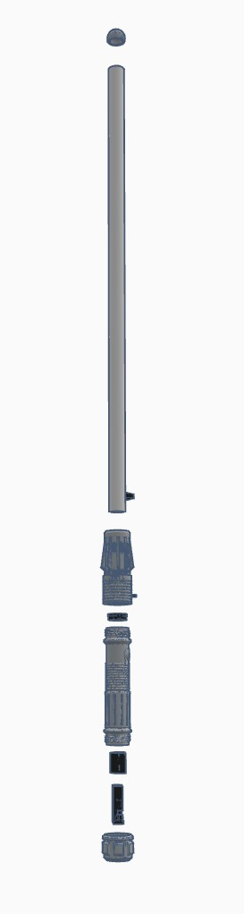

LightSaber Project

A motion-reactive RGBW lightsaber built using **CircuitPython**, **Adafruit RP2040**, **NeoPixels**, and **I2S audio** for authentic sound effects.  
Designed to replicate the ignition, swing, and clash behavior of a real Jedi saber.

---

 Hardware Components

| Component | Description |
|------------|-------------|
| Adafruit Feather RP2040 PropMaker | Main controller with built-in LIS3DH accelerometer |
| NeoPixel Strip (GRBW) | Blade illumination (up to 100 pixels) |
| I2S Speaker | Audio playback for hum, swing, and clash sounds |
| Pushbutton | On/off and color cycle control |
| 3.7V 2200mAh LiPo Battery | Power supply |
| 3D Printed Hilt | Custom-designed lightsaber body |

---

 Wiring Diagram

All components connect directly to the Feather PropMaker RP2040 board.

**Connections Overview:**
| Connection | From | To |
|-------------|------|----|
| NeoPixel Data | `D5` | DIN on NeoPixel strip |
| Speaker | `I2S` pins | Amplified speaker |
| Button | `EXTERNAL_BUTTON` | To GND via pushbutton |
| Power | `VBAT` | 3.7V LiPo (2200mAh) |

---

 Assembly Guide

The saber hilt is composed of multiple 3D-printed sections that house the electronics.

**Assembly Steps:**
1. Insert the **NeoPixel strip** inside the blade tube.  
2. Mount the **speaker** in the base cap for resonance.  
3. Slide the **RP2040 board** and **battery** into the grip section.  
4. Route the **button** wiring through the body and secure it in the switch mount.  
5. Connect all components according to the wiring diagram.  
6. Upload `code.py` and the `sounds/` folder to your board’s **CIRCUITPY** drive.  
7. Power on and enjoy your saber’s ignition and sound effects!

---

Controls

| Action | Result |
|--------|---------|
| Short press | Toggle saber on/off |
| Swing motion | Plays swing sound |
| Tap (impact) | Plays clash sound |
| Long press | Cycle blade color |

---

 Sound Configuration

Store `.wav` files in the `sounds/` directory:
- `0.wav` → Power on  
- `1.wav` → Hum (looped)  
- `2.wav` → Power off  
- `3–10.wav` → Clash sounds  
- `11–18.wav` → Swing sounds  
- `19.wav` → Color change tone  

---

 Code Overview

The main logic handles:
- **Motion detection** via LIS3DH accelerometer  
- **Audio playback** with I2SOut  
- **LED animation** via NeoPixel  
- **Button debounce** with Adafruit Debouncer  

All source code is included in `code.py`.

---

License
MIT License © 2023 Adafruit Industries  
Custom modifications © Kevin H.

